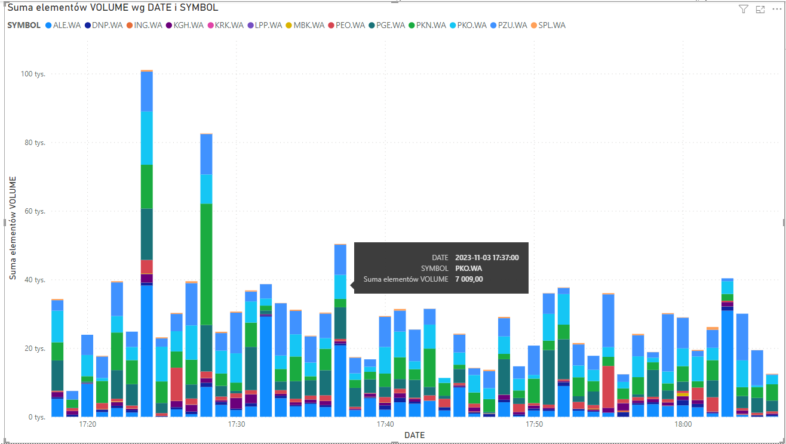

# Streaming Data Warehouse 
## Enigineering thesis | Silesian University of Technology

Streaming data warehouse for stock market data with [Apache Airflow](https://airflow.apache.org/), [Apache Kafka](https://kafka.apache.org/), [Apache Spark](https://spark.apache.org/), [Snowflake](https://www.snowflake.com/en/).

## Description

This engineering thesis, conducted at the Silesian University of Technology, aims to develop an end-to-end data engineering project that leverages streaming data, operating independently of the conducted analyses. The project focuses on the seamless flow and processing of real-time data, demonstrating a modern approach to data engineering and data warehousing.

## Table of Contents

- [Technologies and Tools](#Technologies-and-Tools)
- [Architecture](#Architecture)
- [Installation](#Installation)
- [Usage](#Usage)
- [Images](#Images)
- [Generating Public and Private Keys](#Generating-Public-and-Private-Keys)
- [Contributing](#Contributing)
- [Acknowledgements](#Acknowledgements)
- [License](#License)

## Technologies and Tools
- Docker
- Python
- Apache Airflow
- PostgreSQL
- Apache Kafka
- Apache ZooKeeper
- Apache Spark 
- Snowflake 


## Architecture


## Installation

Download and install [Docker Desktop](https://www.docker.com/products/docker-desktop/) via their website.

Run these commands:
```bash
$ git clone https://github.com/danielwiszowaty/streaming-data-warehouse.git
$ cd streaming-data-warehouse
```

## Usage

Create [Snowflake](https://www.snowflake.com/en/) account.

Create `.env` file with these informations from Snowflake.

```
SF_URL=https://<account_name>.snowflakecomputing.com
SF_ACCOUNT=<account_name>
SF_USER=<username>
SF_PASSWORD=<password>
SF_DATABASE=<database_name>
SF_SCHEMA=<schema_name>
SF_WAREHOUSE=<warehouse_name>
PKB=<pkb_key>
```

pkb_key is necessary to stream the data and can be generated with [Generating Public and Private Keys](#Generating-Public-and-Private-Keys).
#


Run `docker-compose.yaml` using

```bash
$ docker compose up -d --build
```
#
Acces all the platforms using browser via:

- Apache Airflow [localhost:8080](https://localhost:8080)
- Apache Kafka [localhost:9021](https://localhost:9021)
- Apache Spark [localhost:9090](https://localhost:9090)
- Apache Jobs [localhost:4040](https://localhost:4040)
#

Run the DAGs in Apache Airflow
- `get_data_from_Yahoo_Finance` - to produce the stock data from [Yahoo Finance](https://finance.yahoo.com/) to Kafka
- `stream_from_Kafka_to_Spark` - to submit a Spark Job which consumes the messages and streams the data to Snowflake database

## Images



## Generating Public and Private Keys

### Step 1: Generate the Public and Private Key

You can generate either an encrypted version of the private key or an unencrypted version of the private key.

#### Option A: Unencrypted Version

To generate an unencrypted version of the private key, use the following command:

```bash
openssl genrsa -out rsa_key.pem 2048
```

To generate an unencrypted version of the public key, use the following command:

```bash
openssl rsa -in rsa_key.pem -pubout -out rsa_key.pub
```

#### Option B: Encrypted Version

To generate an encrypted version of the private key, use the following command:

```bash
openssl genrsa 2048 | openssl pkcs8 -topk8 -inform PEM -out rsa_key.p8
```

To generate an encrypted version of the public key, use the following command:

```bash
openssl rsa -in rsa_key.p8 -pubout -out rsa_key.pub
```

### Step 2: Assign the Public Key to the Snowflake User

Use the `ACCOUNTADMIN` role to assign the public key to the Snowflake user using the ALTER USER command. For example:

```sql
ALTER USER <user> SET RSA_PUBLIC_KEY='MIIBIjANBgkqh...';
```

### Step 3: Generate a key and assign it in .env

Generate a PKB key via `utils/generate_key.py` with the password you have provided

Set as a `PKB` variable in `.env` file.


## Contributing

Pull requests are welcome. For major changes, please open an issue first
to discuss what you would like to change.


## Acknowledgements

 - [yfinance library](https://github.com/ranaroussi/yfinance)

## License

[MIT](https://choosealicense.com/licenses/mit/)